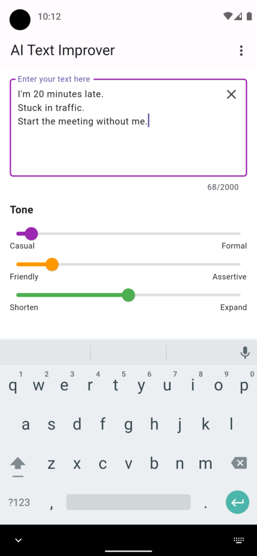
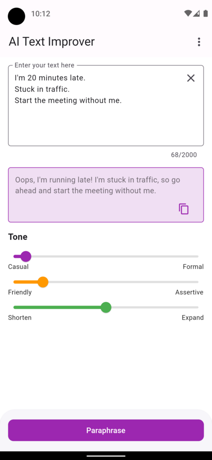
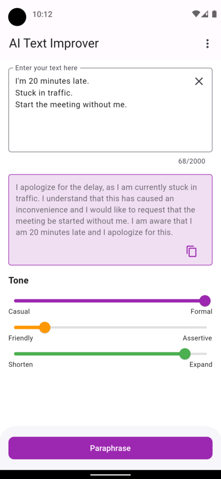
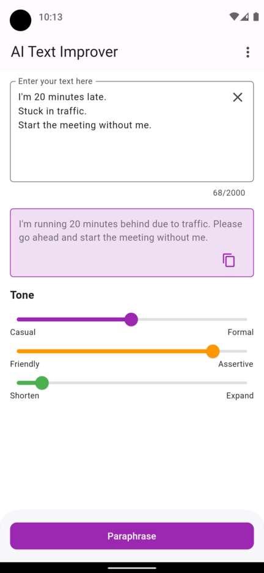
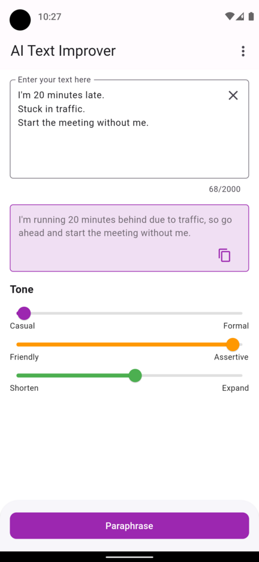
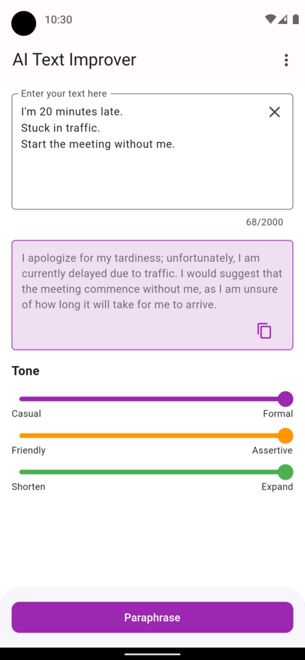

# Texto Text Improver for android and ios 

> An AI-based text improvement tool built in Flutter, powered by GPT.

The _AI Text Improver_ app is a handy Flutter application that allows you to enhance your text messages by providing various tones such as casual, formal, friendly, and more. It leverages the power of GPT (Generative Pre-trained Transformer) as a service to offer you improved versions of your text.

## Installation and Setup

To run the app, you need to have Flutter and Dart installed on your system. Please follow these steps:

* Clone the repository to your computer.
* Start an android emulator, e.g. `~/Android/Sdk/emulator/emulator -avd Pixel_4a_API_30`.
* Navigate to the project directory and run `flutter pub get` to download the dependencies.
* Launch the app by executing `flutter run` in the terminal.
* Upon the first startup, you'll need to provide your own GPT API key. You can obtain a free API key [here](https://beta.openai.com/).

Make sure you have the latest version of Flutter and Dart installed to avoid any compatibility issues.

## License

This app is licensed under the MIT License. You can view, modify, and use the source code for your own projects. A copy of the license can be found in the [LICENSE](LICENSE) file.

## Gallery

    <kbd></kbd>
    <kbd></kbd>
    <kbd></kbd>
    <kbd></kbd>
    <kbd></kbd>
    <kbd></kbd>

